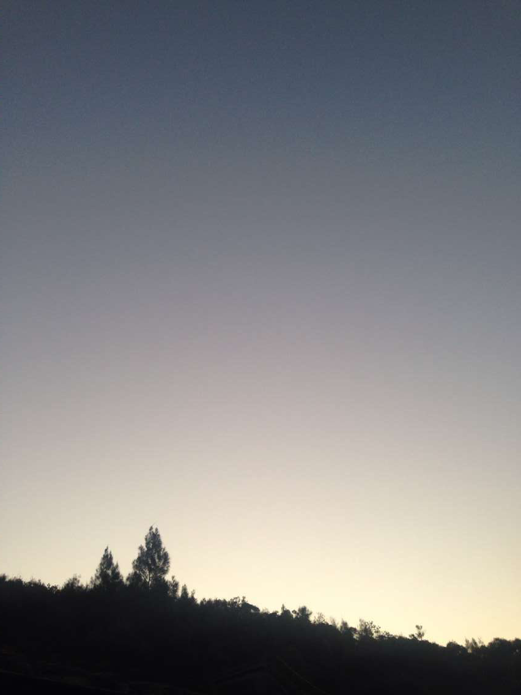

# esilhmt

个人随笔纪录/ *一个现实的浪漫主义者。*

### 关于这个仓库：

  首先，很荣幸见到你。  
  创设这个仓库主要的目的是为了整合一些自己过去曾写过的诗句与感想，集中在一起，这样检索起来就会比较方便查阅。  
  同时也是为了以这样一种别样的形式保留自己过往那些值得珍藏的回忆和情感。  
  我一直都认为，无论是文字，音乐，亦或是图像，这些载体是具有温度的，是能够映射出我们每个人心中美好细腻的一面。  

  通过回顾我曾经写下的那些字句，我可以从字里行间中感受到彼时的悸动，可以感受到成长。如果可以，我希望能够借由这些我曾经写下的字句，让你在阅读时重新认识我，了解一个真实的我。  
  这也是我一直坚持记录的原因。  

  我将根据不同的体裁类型，将不同的文字归纳到不同的子菜单中。子菜单内的内容默认按照原本发表的时间进行排序。  

---

### 以下是现阶段的子菜单列表：

#### [&#8203;``【无关风月】:``&#8203;](./「无关风月」Poetry/)
  主要以诗歌为主，也是主要更新的内容。

#### [&#8203;``【白马非马】:``&#8203;](./「白马非马」Reflection/)
  主要以感想和长文为主。

#### [&#8203;``【南风过境】:``&#8203;](./「南风过境」Story/)
  主要以虚拟故事为主。

#### 【竹影清风】：
  主要以记录回忆为主。

#### 【十二月的晚安】：
  记录我在12/01/2019至01/01/2020其间所编写的分享日志。  
  每一篇文章会有一首诗，一支歌，以及一些个人的感想。  

  最后，希望你能喜欢我的文字。  
  早安，晚安。  

