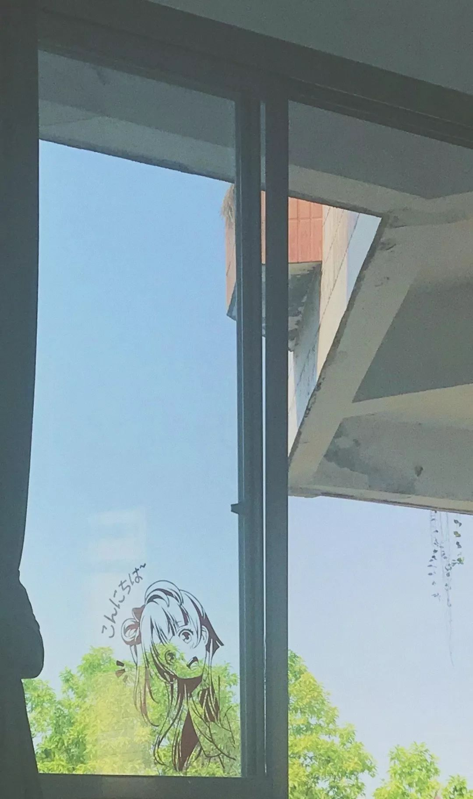

初二那年，夏末秋初的午后。
热风裹挟着蝉鸣，吹过窗外一排排棕榈树，发出一阵又一阵沙沙的声响。

午休，聒噪的教室。
几个男生在前排嬉闹。
我坐在座位上，托着腮帮，把玩着手中的圆珠笔。在这个季节，似乎时针划过的每一秒都带着温度。
滴答，滴答。
冗长且沉闷。

在英语练习卷上草草写下了名字，无心学习。喝了口水后，便看向左前方的窗外。在这个季节，白云和蓝天与往日相比显得更饱有色彩。
热风吹过杂乱的桌面，翻页了日记。

上课铃响起。
回过神，瞥了一眼走道。
果不其然，她又迟到了。

那个站在班级门口喘着气的短发少女是我第一个喜欢的女孩，我想，也会是唯一一个。
她是班级里的语文课代表。
气质优雅，成绩优异，笑容优美。
可谓是课代表中的课代表。
似乎一切字典里我能找到有关温柔的形容词都是为她量身定制的，一个近乎完美的人。
对我而言，连偶尔会迟到这点，也成了她可爱的加分项。

所以我常在心中沾沾自喜。
因为，她的座位就在我的左前方。
每当我看向窗外，都能在不经意间看见她的侧脸。或者说，每次我看向她时，都能装作是在漫不经心地看向窗外。

她一路小跑，匆匆回到了座位上。
我下意识地低头，装作毫不在意的样子，生怕被她发现。
却不知脸上早已泛起了红晕。

坐在她身旁，连空气中都弥漫着淡淡的花香。
这看不见的花香，就如同窗外的蓝天与白云一般，都是属于我青春里不可磨灭的印记。

上课间，心思浑然不在。
偶尔装模作样地抬头抄写黑板上老师讲解的题注，却不过是借着余光在科作业纸上一板一眼，勾勒她的脸庞。

正如我所提及的，她是一个优秀的女孩，深受欢迎。
理所当然，我并不是唯一留意她的男孩。
也许是不自信，也许是害怕打破这情感间微妙的平衡，我并未向她袒露那些被深埋在心底的悸动。

“请某些同学上课认真听讲，不要东张西望。”

老师的一句调侃将我拉回到了这间不大的教室。
急忙转过脑袋，用空白的练习卷盖过稿纸。飘忽的目光不知该如何安放，只好自顾自把玩着手中的铅笔。

呼哧，呼哧。
乱了节奏。

“你说，他一直回头看你，是不是因为喜欢你呀。”
前桌往左凑了凑，向她小声递话。
而句子里的另一个他，指的是坐在我喜欢女孩右前方的男班长，与我隔了两排。

“阿？”
她好像还没反应过来。

“班长刚刚上课的时候回头看了你好几眼呢，这不是超级明显在示好吗。因为喜欢你才会回头偷偷看你呢。这不，还被老师抓了个现行。”
前桌遮掩笑意，向她解释。

“原来喜欢一个人，就代表会回头看他呀。”
她小声嘀咕着。

在低头侧耳听完她们间的对话后，不禁为自己的自作多情感到可笑与尴尬。

“老师没有注意到我，挺好的。”
我这么宽慰着怅然若失的自己，心底却不知为何多了几分莫名的醋意。

过了一会，调整好平静的心情。回过头，望了眼窗外的蓝天与白云。
悄悄欣赏着玻璃上映射她的侧脸。
再次看向她。

在那个瞬间，她也回过头看我。
带着温柔的目光，微笑着。

不经意间的对视，像夏末的一阵热风，吹过了我心中的每一个角落。

一切美好，都定格在短短的几秒。
难忘且珍贵。

“余一凡同学，上课不要左顾右盼。”
老师的一句提醒将我拉回到了这间不大的教室。
急忙转过脑袋，用手捂着发烫到不行的脸颊，目光却还是忍不住地偷偷瞥向她。

扑通，扑通。
夏末秋初的午后。
我在阵阵蝉鸣中，听见了心跳。

11/22/2019

