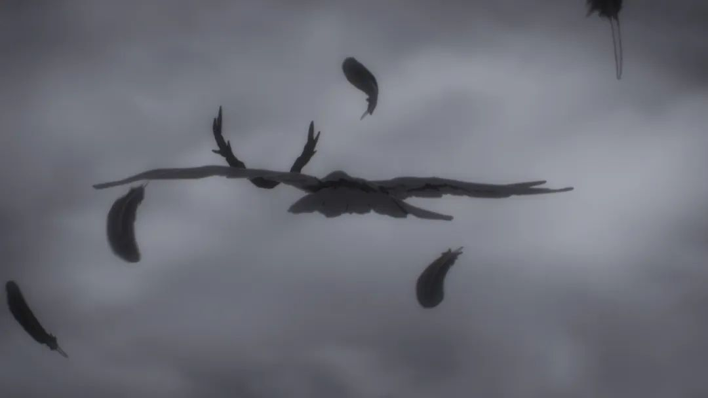

漏雨的地窖里，  
我拾起一张破旧的渔网，  
轻柔投于生命的汪洋。  
浮标飘摇，  
在岁月里流转。  
  
  
历经长夜，  
我漂泊于孤舟之上。  
摇曳喜乐，围捕哀伤。  
筛细网眼里的忧柔，  
任情愫铺展。  
  
风暴袭过，  
我与暗涌和海浪对抗。  
挣扎，  
倾翻，释然。  
漏失无数往日光景。  
回忆和梦想，  
随着铅锤沉沦于无底黑暗。  
  
放弃了期盼，  
我扯去浸满血汗的衣袖，  
凝望着折断的桨。  
  
坐在湿咸的沙岸旁，  
我捞起那张破旧的渔网。  
留下的  
却只是一场空荡，  
写满遗憾的回想。  
  
02/29/2024  
  
  
  
『僕だけがいない街』  
  
  
  
