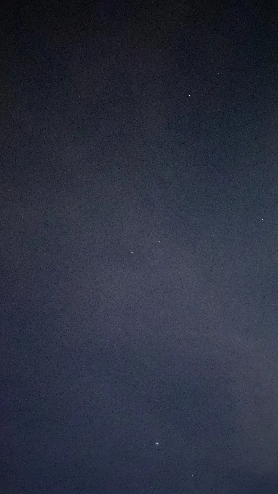
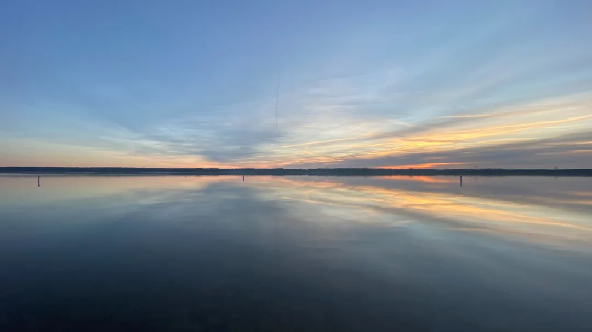

云影被朝阳晕染，  
连同霞光，  
洒落在镜面般的湖上。  
  
一阵风吹熄失温的夜晚。  
  
我凝视着远方。  
恍惚间，似乎又对上，  
那年破晓时分，    
你望向我温柔的目光。  
     
11/25/2024    
  
    
清晨的夜空  
摄于哥伦布 12/17/2021  
  
    
第一次和她一起看的日出  
摄于哥伦布 12/17/2021    