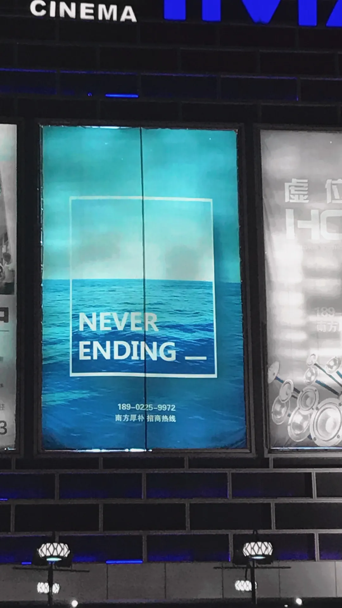

前段时间，一直保持着联系的朋友发来简讯，告诉我，那天是彼此认识十周年的纪念日。  
十年，曾经在我看来遥不可及的未来，如今像被风吹散的细沙，转瞬即逝。  
从二零一三年到如今，也已经过去十年了。  
  
而那一年，是对我来说是最重要的一年。  
我在二零一三年夏天经历的故事，做出的决定，遇见的人，将使我踏上一段我不曾预见的旅程。一切似乎都还历历在目，却已经十年了。  
  
十年后，我仍然很怀念那个夏天。  
  
那一年，是我小升初的转折点。无忧无虑，没有家庭作业的盛夏。  
  
汽水、空调、热浪、蝉鸣。  
艳阳下的水泥石板白的耀眼，无人的工厂。  
晚风吹过，河面泛起涟漪。  
  
一切对于夏季的幻想在那时都被满足了。  
  
好奇即将到来的初中生活，每一天都在了解新的事物，每一天都在期待着明天的到来。  
制图、剪辑、建模、游戏制作。  
虽然当时没有太系统地深入，但那个夏天所开始学习到的技能，在未来十年改变了我无数的人生轨迹。  
如今的我依旧很佩服那时的自己，对于喜欢的东西抱有极大的热忱，有用不完的精力去面对未知的事物。  
  
而在那个夏天，我也认识了很多人。大部分都是初中的同学，其中有很多朋友至今仍然保持着联系。  
这也是我一直很在乎的一点，漫长岁月里的情谊。  
  
十年的时间，他们见证了我的一次又一次成长，陪伴我度过了我最重要的青春 也看着我从不谙世事到如今即将步入社会。  
虽然我依旧还是很幼稚，但有时还是会开心，我能够在我朋友面前继续当一个不那么现实和成熟的男孩。  
  
不知道屏幕前的你是不是文光的同学，但如果是，我想，今年或者明年应该也是我们认识的第十年吧，在这里悄悄说一句十周年快乐。  
  
十年时间，很多东西都会改变。  
在不断的变化中，那些不变的，则是我最珍视的。  
  
岁月能使我忘掉很多东西，也能使我学会很多。时光足够让幸福减淡，也足够让伤痛结痂。  
它不同于我的未来。它之所以对我那么重要，是因为过去十年，是我开始真正接触这个社会，真正体验无数的第一次，性格与观念塑造的十年。  
无数个日夜，成为了我生命与人格的基石。  
  
十年，曾经在我看来遥不可及的未来，如今像无数被风吹散的细沙，划过我的面颊。  
我不能将岁月留下，它也无法将我带走。  
  
如果要我回答，未来十年我最希望的是什么。我想，应该是在未来十年，我能不忘记从前的自己，同时去做到，不会让未来，过去的我会后悔的决定。  
  
这个是我很高兴在过去十年我有做到的事情。在成长的过程中知道自己内心想要的东西，在乎的事物是什么。没有让自己留下遗憾。  
但我也知道这很难。在未来无数个分叉的路口，想要去获得和拥有所有，是不可能的。  
  
我无法奢求未来，所以我努力地在珍惜过去。有些时候我也害怕我太执着于过往，会怅然若失，会优柔，反而错过更多。  
但我知道，每一刻无法重复的过去，都能够提醒我所爱、所获、所失、所得。  
  
我不希望有一天我会麻木掉那些，曾经我所无比珍视的悸动，这种自知是无论过去还是未来的我都需要的情感。  
  
而这十年时间，我从未觉得它漫长，却也未曾停下来想过它竟如此短暂。  
像梦一般，回想起来，只有破碎的模糊片段。  
  
晚安。  
  
12/3/2023  
  
    
