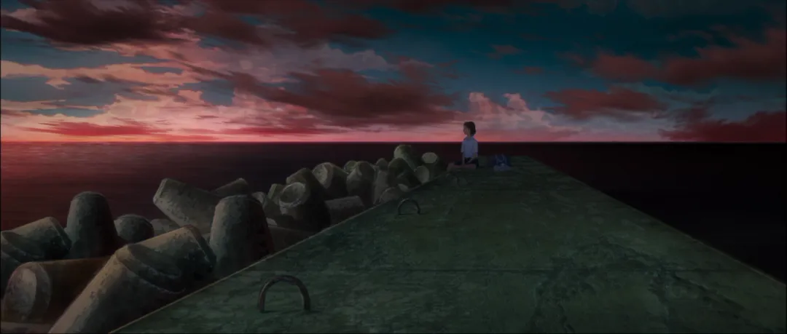

有时，在夜深或那些意外醒来的清晨。  
看着未破晓的天，我还是会忍不住去想，去思考：如果有机会回到过往人生的某个节点，某个通往分别的岔路口。  
如果当初的我做出了不一样的选择，是否就能改变故事的结局，是否我会更开心一些，是否还有机会与你相遇。  
是否就没有如今的是否。  
  
但在感怀的同时，我也不免为自己感到有几分的可笑。  
我比谁都能清楚地认识到我生活中的幸福，我能清晰地感受到他人对我的信任与爱意。我不应该，也并不希望自己是一个自哀自怨的人。  
而且，这种悲伤和忧愁的情绪也并不能使我的内心平静。在某种意义上，这种沉溺在过去的感觉，不过是自我内心懦弱的表现。  
  
但我就是无法克制住自己的思绪，我没办法让自己去忽视那些擦肩而过的美好。  
  
而时过境迁，随着我遇到了越来越多的人，见过了越来越多的离别。  
也许是日子的忙碌让我无暇去思索；又或许是我长大了，成熟了，学会放下自我的执着与多愁善感；再或许，只是我单纯地不再那么在意了。  
无论出于何种原因，我发现，我回头凝望过去的次数也随之减少。  
  
我不再那么容易难过，可我也并不快乐。  
  
「所有的欲求如道路般纵横交错，却永远无法抵达终点。」  
  
也是从那时，我慢慢察觉到，顺从于自己本能对美好的渴望或诉求并不是一种耻辱，它反而会使自己更好过一些。  
  
无所顾忌地往前走，也许很好。但那并不是人生唯一的方向。因为人生从来就不该预设所谓的终点，不是吗？  
很多人也许会认为，感性会让自己变得自作多情，优柔寡断。可在我看来并不是这样。接纳自己的情绪往往比逃避更需要勇气。  
在不伤害他人，不影响生活的前提下，试着去面对自己可能做错的决定，承认自己并不完美的爱意。  
  
凝视着那些或多或少伴随着遗憾的曾经，也许是一件痛苦的事情。  
但我不会选择摒弃痛苦，它并不是沉重的包袱。相反，对我而言，唯有痛苦才能让我明白爱与美好的价值。  
而我之所以会这么认为，我想是因为我对情感的在意，无论是我那些所收获的，或我所给予的。  
快乐亦或是悲伤，都是属于我不可分割的人生。  
  
而此时此刻，在这如同深夜般未眠的清晨。  
看着已破晓的天，我还是忍不住停下来思考：如果有机会回到过往人生的某个节点，某个通往分别的岔路口。  
如果故事的结局注定无法改变，当初的我是否还愿意做出一样的选择。  
  
再在美好中，与你重蹈一遍遗憾的覆辙。  
  
09/18/2021  
    
      
