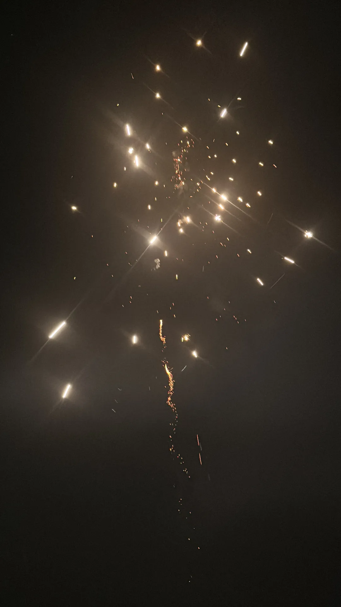

这是我于今年，二零二四年，写下的最后一段文字。  
春去冬来，不过晃眼，岁末的风再次吹过了街角，吹来了一阵愁雨。  
想来前几年的时光，每到这个时刻，过去自己总会借着机会写下感慨，表达自我。  
  
但也不知从什么时候开始，写作对我而言似乎失去了一些色彩，或者说像失去了一部分表达的动力。  
也许是因为过去一段时间太过压抑，抑或是我还无法适应生活上巨大的转变。   
过去一年的一切，似乎都拖着我，拽着我，裹挟着我，让我陷在一场似乎已经结束却永远不愿醒来的梦里。

真正停下来思考过去的一年，不禁感慨，时间真的太快。  
还没来得及用心感受那些往日美好的悸动，这些悸动就如云烟般消散在一阵阵风中。

「过去，未来。」  
我常常想，常常回望。审视自我的决定，想要从不同的视角来窥视自己的内心，去了解自我，走近自我。  
去明白，我内心真正想要的，渴求的是什么。

我一直都相信事在人为，岁月流经我，或在我身上留下，或将我情愫带走，无法改变我。  
但我也犹豫，我也踌躇。所做的是否是对的，我选择的是否只是一厢情愿错误的执念。

生命的一切究竟是我的决定，还是我的生命只是恰好如此经过。

但无论如何，人生不就是用来体验，用来感受的吗。  
所有鲜活的回忆都是我宝贵一生不可分离的一部分，是构筑我灵魂的碎片。  
无论是什么样的颜色，或悲伤或欢喜，都是我想要用力拥抱，努力留住的时光。  
比起犯错，我更害怕错过，悔过。

年年岁岁，岁岁年年。  
一晃眼，时过境迁，屏幕前的你认识我到现在又是几年。  
我变了多少，又有多少没变。   

但无论会得到怎样的回答，我都希望如果还有机会见面。无论在何时，无论在何处，彼此都能笑着说出那句「好久不见。」  
和初见时一样，不变。

一晃眼，又会是春天。  
祝你新年快乐。

12/31/2024  

    